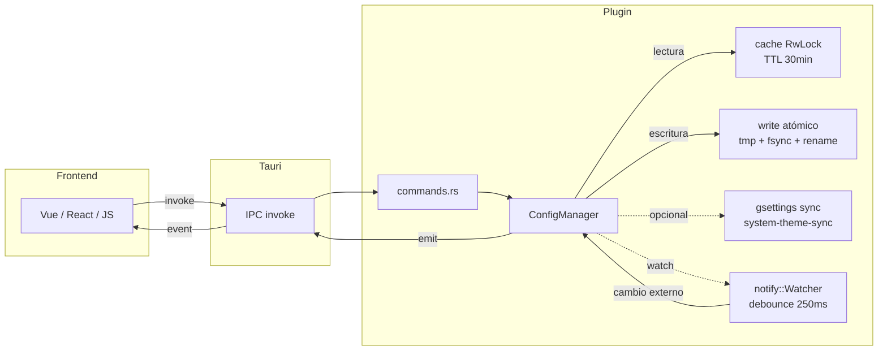

# @vasakgroup/plugin-config-manager

[](https://www.npmjs.com/package/@vasakgroup/plugin-config-manager)
[](https://www.npmjs.com/package/@vasakgroup/plugin-config-manager)
[](https://www.gnu.org/licenses/lgpl-3.0.html)
[](https://tauri.app/)

Plugin de Tauri para persistir, leer y observar configuración de aplicaciones Vasak. Diseñado para Vue 3 + Pinia con soporte para cualquier frontend Tauri.

## Features

| Capacidad | Detalle |
|---|---|
| Persistencia atómica | Escritura vía archivo temporal + `rename` (fsync incluido) |
| Cache con TTL | Cache dual (config + schemes) con TTL configurable de 30 min |
| Watch de archivos | Detección de cambios externos vía `notify` con debounce de 250ms |
| Temas visuales | Esquemas de color con paletas UI, terminal y ansi (dark/light) |
| Sincronización GNOME | `gsettings` para tema, iconos y color-scheme (feature flag) |
| Evento en tiempo real | `config-changed` emitido a todo frontend conectado |
| Logging estructurado | Via `tracing` (error/warn según severidad) |

## Instalación

### Frontend

```bash
npm install @vasakgroup/plugin-config-manager
# o
bun add @vasakgroup/plugin-config-manager
```

### Backend Tauri

```toml
[dependencies]
tauri-plugin-config-manager = { git = "https://github.com/Vasak-OS/tauri-plugin-config-manager" }
```

```rust
fn main() {
    tauri::Builder::default()
        .plugin(tauri_plugin_config_manager::init())
        .run(tauri::generate_context!())
        .expect("error while running tauri application");
}
```

## API

### `readConfig(): Promise<VSKConfig | null>`

Lee la configuración desde archivo con cache-first. Si el archivo no existe, lo crea con defaults y lo retorna.

```ts
const config = await readConfig();
if (config) {
  console.log(config.style.darkmode); // boolean
  console.log(config.style["color-scheme"]); // string
}
```

### `writeConfig(value: VSKConfig): Promise<void>`

Valida y persiste la configuración completa. Escribe atómicamente, actualiza el cache y emite `config-changed`.

```ts
await writeConfig({
  style: { darkmode: true, "color-scheme": "vasak-default", radius: 8 },
  desktop: { wallpaper: [], iconsize: 48, showfiles: true, showhiddenfiles: false },
  fonts: { terminal: "JetBrains Mono", title: "Inter", apps: "Noto Sans" },
  icons: { dark: "Papirus-Dark", light: "Papirus-Light" },
});
```

### `setDarkMode(darkmode: boolean): Promise<void>`

Cambia `style.darkmode`, persiste y sincroniza GNOME (si está disponible y feature habilitada).

```ts
await setDarkMode(true);  // Activa dark mode + sincroniza GNOME
await setDarkMode(false); // Vuelve a light mode
```

### `getSchemes(): Promise<Scheme[]>`

Lista todos los esquemas de color disponibles. Cacheado con TTL de 30 minutos.

```ts
const schemes = await getSchemes();
schemes.forEach(s => console.log(s.scheme.name));
```

### `getSchemeById(schemeId: string): Promise<Scheme | null>`

Busca un esquema por ID con prioridad de rutas configurable via `VASAK_SCHEMES_PATHS`.

```ts
const scheme = await getSchemeById("vasak-default");
if (scheme) {
  document.documentElement.style.setProperty("--primary", scheme.scheme.colors.light.ui.color.primary);
}
```

### `useConfigStore()`

Store de Pinia que carga config, aplica dark mode class al `<html>` e inyecta todas las variables CSS del esquema activo.

```ts
const configStore = useConfigStore();
await configStore.loadConfig();
```

## Tipos

```ts
export type VSKConfig = {
  style: {
    darkmode: boolean;
    "color-scheme": string;
    radius: number;
  };
  desktop: {
    wallpaper: string[];
    iconsize: number;
    showfiles: boolean;
    showhiddenfiles: boolean;
  };
  fonts: {
    terminal: string;
    title: string;
    apps: string;
  };
  icons: {
    dark: string;
    light: string;
  };
};

export type Scheme = {
  path: string;
  scheme: SchemeData;
};

export type SchemeData = {
  id: string;
  name: string;
  author: string;
  description: string;
  version: string;
  colors: SchemeColors;
};

export type SchemeColors = {
  dark: ThemeVariant;
  light: ThemeVariant;
};

export type ThemeVariant = {
  ui: UiColors;
  terminal: TerminalColors;
};

export type UiColors = {
  color: { primary: string; secondary: string };
  text: { main: string; muted: string; "on-primary": string };
  background: string;
  border: string;
  surface: string;
};

export type TerminalColors = {
  foreground: string;
  background: string;
  cursor: string;
  ansi: AnsiColors;
};

export type AnsiColors = {
  black: string;  red: string;  green: string;  yellow: string;
  blue: string;  magenta: string;  cyan: string;  white: string;
  brightBlack: string;  brightRed: string;  brightGreen: string;
  brightYellow: string;  brightBlue: string;  brightMagenta: string;
  brightCyan: string;  brightWhite: string;
};
```

## Casos de uso

### App Vue 3 con Pinia (recomendado)

```vue
<script lang="ts" setup>
import { onMounted, onUnmounted } from "vue";
import { listen } from "@tauri-apps/api/event";
import { useConfigStore } from "@vasakgroup/plugin-config-manager";

const configStore = useConfigStore();
let unlisten: (() => void) | null = null;

onMounted(async () => {
  await configStore.loadConfig();

  // Reaccionar a cambios externos (otro proceso editó el archivo)
  unlisten = await listen("config-changed", async () => {
    await configStore.loadConfig();
  });
});

onUnmounted(() => unlisten?.());
</script>

<template>
  <div class="app" :class="{ dark: configStore.config?.style?.darkmode }">
    <h1>{{ configStore.config?.style?.["color-scheme"] }}</h1>
    <button @click="configStore.loadConfig()">Recargar</button>
  </div>
</template>
```

### React sin store

```tsx
import { useEffect, useState } from "react";
import { listen } from "@tauri-apps/api/event";
import { readConfig, writeConfig, setDarkMode } from "@vasakgroup/plugin-config-manager";
import type { VSKConfig } from "@vasakgroup/plugin-config-manager";

function App() {
  const [config, setConfig] = useState<VSKConfig | null>(null);
  const [dark, setDark] = useState(false);

  useEffect(() => {
    readConfig().then(setConfig);
    const unlisten = listen("config-changed", async () => {
      const cfg = await readConfig();
      setConfig(cfg);
    });
    return () => { unlisten.then(fn => fn()); };
  }, []);

  const toggleDark = async () => {
    await setDarkMode(!dark);
    setDark(!dark);
  };

  return <button onClick={toggleDark}>Modo oscuro: {dark ? "ON" : "OFF"}</button>;
}
```

### Selector de esquemas de color

```tsx
import { useEffect, useState } from "react";
import { getSchemes, getSchemeById, readConfig, writeConfig } from "@vasakgroup/plugin-config-manager";
import type { Scheme } from "@vasakgroup/plugin-config-manager";

function SchemePicker() {
  const [schemes, setSchemes] = useState<Scheme[]>([]);

  useEffect(() => { getSchemes().then(setSchemes); }, []);

  const apply = async (schemeId: string) => {
    const config = await readConfig();
    if (!config) return;
    config.style["color-scheme"] = schemeId;
    await writeConfig(config);
  };

  return (
    <select onChange={e => apply(e.target.value)}>
      {schemes.map(s => (
        <option key={s.scheme.id} value={s.scheme.id}>{s.scheme.name}</option>
      ))}
    </select>
  );
}
```

## Variables CSS inyectadas por el store

Cuando se usa `useConfigStore()`, el store inyecta automáticamente ~60 variables CSS en `<html>`:

| Grupo | Prefijo | Ejemplo |
|---|---|---|
| Marca | `--primary`, `--secondary` | `#ab47bc` |
| Marca (dark) | `--primary-dark`, `--secondary-dark` | `#ce93d8` |
| UI | `--ui-background`, `--ui-surface`, `--ui-border` | `#ffffff` |
| UI (dark) | `--ui-background-dark`, `--ui-surface-dark`, `--ui-border-dark` | `#1e1e1e` |
| Texto | `--text-main`, `--text-muted`, `--text-on-primary` | `#212121` |
| Texto (dark) | `--text-main-dark`, `--text-muted-dark`, `--text-on-primary-dark` | `#e0e0e0` |
| Estado | `--status-error`, `--status-success`, `--status-warning` | `#ef5350` |
| Estado (dark) | `--status-error-dark`, `--status-success-dark`, `--status-warning-dark` | `#ef9a9a` |
| Terminal | `--terminal-foreground`, `--terminal-background`, `--terminal-cursor` | `#000000` |
| Terminal (dark) | `--terminal-*-dark` | `#ffffff` |
| Ansi (16 colores) | `--terminal-ansi-{color}` y `--terminal-ansi-{color}-dark` | `#000000`..`#ffffff` |
| Radio | `--corner-radius` | `8px` |

## Arquitectura interna




- **Cache**: TTL de 30 minutos, `RwLock` para lecturas concurrentes sin bloqueo entre sí. Se invalida automáticamente al expirar o al escribir.
- **Escritura atómica**: `write()` → `fsync()` → `rename()`. Previene corrupción ante cortes de energía.
- **Watch**: Usa `notify` recommended watcher (inotify en Linux). Debounce de 250ms para evitar reaccionar a escrituras rápidas en ráfaga.
- **Schemes cache**: Misma estrategia TTL, ideal porque los esquemas rara vez cambian en disco.

## Variables de entorno

| Variable | Efecto |
|---|---|
| `VASAK_CONFIG_PATH` | Ruta absoluta al archivo de configuración. Default: `~/.config/vasak/vasak.conf` |
| `VASAK_SCHEMES_PATHS` | Paths separados por `:` para buscar esquemas. Default: `~/.config/vasak/schemes` y `/usr/share/schemes` |

## Feature flags

```toml
# Defecto: incluye sincronización GNOME
tauri-plugin-config-manager = { git = "..." }

# Sin sincronización GNOME
tauri-plugin-config-manager = { git = "...", default-features = false }
```

Cuando `system-theme-sync` está habilitado:
- `setDarkMode()` sincroniza `org.gnome.desktop.interface.color-scheme` y `gtk-theme`
- `writeConfig()` aplica el icon theme de GNOME según `icons.dark` / `icons.light`
- Si `gsettings` no está disponible, se omite silenciosamente

## Permisos Tauri

El plugin define 5 comandos, todos habilitados por defecto:

| Permiso | Comando |
|---|---|
| `allow-read-config` | `read_config` |
| `allow-write-config` | `write_config` |
| `allow-set-darkmode` | `set_darkmode` |
| `allow-get-schemes` | `get_schemes` |
| `allow-get-scheme-by-id` | `get_scheme_by_id` |

## Eventos

| Evento | Cuándo se emite | Payload |
|---|---|---|
| `config-changed` | Archivo modificado externamente o via `writeConfig()` / `setDarkMode()` | `()` |

Escuchar desde el frontend:

```ts
import { listen } from "@tauri-apps/api/event";

const unlisten = await listen("config-changed", () => {
  console.log("Config changed, reloading...");
  await readConfig();
});
```

## Migración

### De invocación raw Tauri a este plugin

**Antes:**
```ts
await invoke("plugin:config-manager|read_config");
```

**Después:**
```ts
import { readConfig } from "@vasakgroup/plugin-config-manager";
const config = await readConfig();
```

### De configuración inline a store Pinia

**Antes:**
```ts
const json = await invoke("plugin:config-manager|read_config");
const config = JSON.parse(json);
document.documentElement.classList.toggle("dark", config.style.darkmode);
```

**Después:**
```ts
import { useConfigStore } from "@vasakgroup/plugin-config-manager";
const store = useConfigStore();
await store.loadConfig();
// Dark mode y variables CSS ya están aplicadas
```

## Licencia

LGPL-3.0-or-later
