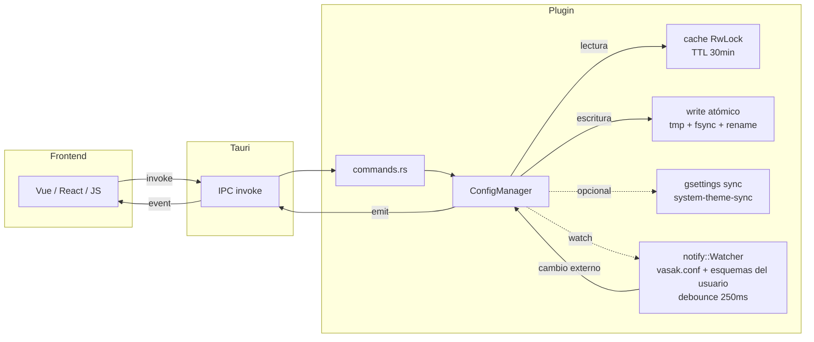

# @vasakgroup/plugin-config-manager

[](https://www.npmjs.com/package/@vasakgroup/plugin-config-manager)
[](https://www.npmjs.com/package/@vasakgroup/plugin-config-manager)
[](https://www.gnu.org/licenses/lgpl-3.0.html)
[](https://tauri.app/)

Plugin de Tauri para persistir, leer y observar configuración de aplicaciones Vasak. Diseñado para Vue 3 + Pinia con soporte para cualquier frontend Tauri.

## Features

| Capacidad | Detalle |
|---|---|
| Persistencia atómica | Escritura vía archivo temporal + `rename` (fsync incluido) |
| Cache con TTL | Cache dual (config + schemes) con TTL configurable de 30 min |
| Watch de archivos | `vasak.conf` y el directorio de esquemas del usuario, vía `notify`, con debounce de 250ms al final de la ráfaga |
| Temas visuales | Esquemas de color con paletas UI, terminal y ansi (dark/light) |
| Sincronización GNOME | `gsettings` para tema, iconos y color-scheme (feature flag) |
| Evento en tiempo real | `config-changed` emitido a todo frontend conectado |
| Logging estructurado | Via `tracing` (error/warn según severidad) |

## Instalación

### Frontend

```bash
npm install @vasakgroup/plugin-config-manager
# o
bun add @vasakgroup/plugin-config-manager
```

`vue`, `pinia` y `@tauri-apps/api` son dependencias **pares**: las pone la
aplicación, no este paquete. Desde la 2.9.0 `pinia` se pide en `^3.0.4 || ^4.0.0`.

| Par | Rango |
|---|---|
| `vue` | `^3.5.35` |
| `pinia` | `^3.0.4 \|\| ^4.0.0` |
| `@tauri-apps/api` | `^2.11.0` |

No es un detalle de empaquetado: la tienda que exporta `useConfigStore` vive en
la `pinia` de la aplicación. Si el complemento se trajera la suya quedarían dos
copias, y dos copias de `pinia` son dos tiendas activas —la aplicación arranca
con «getActivePinia() was called but there was no active Pinia»—. Con `vue` es
peor todavía: dos sistemas de reactividad, y el fallo sin mensaje claro.

Las dos líneas de `pinia` entran en el rango porque el complemento no usa nada
que las distinga: `defineStore` y el tipo `Store`, iguales en la 3 y en la 4. La
2.7.0 y la 2.8.0 pedían sólo `^4.0.0`, y con eso las aplicaciones que siguen en
`pinia` 3 no las podían instalar: quedaron fijas en `~2.6.1`, sin nada de lo que
vino después. Con las dos en el rango, la par se resuelve con la copia que tenga
la aplicación, sea cual sea, y sigue habiendo una sola. Se comprobó corriendo las
pruebas y `tsc` con cada una.

### Backend Tauri

```toml
[dependencies]
tauri-plugin-config-manager = { git = "https://github.com/Vasak-OS/tauri-plugin-config-manager" }
```

```rust
fn main() {
    tauri::Builder::default()
        .plugin(tauri_plugin_config_manager::init())
        .run(tauri::generate_context!())
        .expect("error while running tauri application");
}
```

## API

### `readConfig(): Promise<VSKConfig | null>`

Lee la configuración desde archivo con cache-first. Si el archivo no existe, lo crea con defaults y lo retorna.

```ts
const config = await readConfig();
if (config) {
  console.log(config.style.darkmode); // boolean
  console.log(config.style["color-scheme"]); // string
}
```

### `writeConfig(value: VSKConfig): Promise<void>`

Valida y persiste la configuración completa. Escribe atómicamente, actualiza el cache y emite `config-changed`.

```ts
await writeConfig({
  style: { darkmode: true, "color-scheme": "vasak-default", radius: 8 },
  desktop: { wallpaper: [], iconsize: 48, showfiles: true, showhiddenfiles: false },
  fonts: { terminal: "JetBrains Mono", title: "Inter", apps: "Noto Sans" },
  icons: { dark: "Papirus-Dark", light: "Papirus-Light" },
});
```

### `setDarkMode(darkmode: boolean): Promise<void>`

Cambia `style.darkmode`, persiste y sincroniza GNOME (si está disponible y feature habilitada).

```ts
await setDarkMode(true);  // Activa dark mode + sincroniza GNOME
await setDarkMode(false); // Vuelve a light mode
```

### `getSchemes(): Promise<Scheme[]>`

Lista todos los esquemas de color disponibles. Cacheado con TTL de 30 minutos.

```ts
const schemes = await getSchemes();
schemes.forEach(s => console.log(s.scheme.name));
```

### `getSchemeById(schemeId: string): Promise<Scheme | null>`

Busca un esquema por ID con prioridad de rutas configurable via `VASAK_SCHEMES_PATHS`.

```ts
const scheme = await getSchemeById("vasak-default");
if (scheme) {
  document.documentElement.style.setProperty("--primary", scheme.scheme.colors.light.ui.color.primary);
}
```

### `saveUserScheme(scheme: SchemeData): Promise<Scheme>`

Guarda un esquema en el directorio de esquemas **del usuario** como `<id>.json`
y devuelve `{ path, scheme }`. Es el mismo JSON que hay dentro de un archivo de
esquema.

- El directorio del usuario es **el primero** de las rutas de esquemas: sin
  `VASAK_SCHEMES_PATHS`, `~/.config/vasak/schemes`; con la variable, su primera
  entrada no vacía. Es también el que gana al buscar por id, así que un esquema
  guardado con el id de uno del sistema lo tapa sin tocarlo. Si esa primera
  ruta cae dentro de `/usr`, se rechaza: nunca se escribe en
  `/usr/share/schemes`.
- El `id` tiene que cumplir `^[a-z0-9][a-z0-9-]{0,63}$` (es el nombre del
  archivo); si no, error.
- Crea el directorio si falta, escribe de forma atómica (temporal oculto en el
  mismo directorio + `rename`) e invalida el caché de esquemas.
- No emite `config-changed` por su cuenta: lo emite el vigilante de cada
  aplicación al ver el archivo, incluida la que guardó.
- Necesita `config-manager:allow-save-user-scheme`, que **no** está en el
  conjunto por defecto (ver [Permisos Tauri](#permisos-tauri)).

```ts
const { path } = await saveUserScheme({ ...scheme.scheme, id: "custom", name: "Personalizado" });
```

Lo que el archivo tenga y el modelo no declare —un campo nuevo en cualquier
nivel— se conserva: leer un esquema y volver a guardarlo no pierde nada.

### `useConfigStore()`

Store de Pinia que carga config, aplica dark mode class al `<html>` e inyecta todas las variables CSS del esquema activo.

```ts
const configStore = useConfigStore();
await configStore.loadConfig();
```

Después de la primera carga pone la clase `scheme-transition` en `<html>` (dos cuadros
después, para no fundir desde los colores de fábrica al abrir). Con vue-libvasak ≥ 2.10,
cada cambio de esquema siguiente se funde en 300 ms.

### Colores desde el fondo de pantalla (2.10.0)

«Seguir al fondo» del esquema `custom`: la paleta del fondo y los colores de interfaz con
el contraste garantizado (4,5:1 texto, 3:1 acentos, en las dos variantes). Los colores
fijados a mano, el fondo de origen y el interruptor viven en `custom.json`, clave
`wallpaper-colors`.

```ts
import { followWallpaper, getSchemeById, readConfig, saveUserScheme } from "@vasakgroup/plugin-config-manager";

// En cada `config-changed` (lo hace vasak-desktop):
const outcome = await followWallpaper({
  readConfig,
  loadScheme: async (id) => (await getSchemeById(id))?.scheme ?? null,
  readPixels: (path) => invoke("wallpaper_pixels", { path }), // RGB crudo de la app
  save: saveUserScheme,
});
// "applied" | "off" | "unchanged" | "not-custom" | "unreadable" | …
```

Las piezas sueltas: `extractPalette(pixels)`, `buildWallpaperPatches(scheme, palette, pinned)`,
`applyWallpaperColors(scheme, palette, source)`, `ensureContrast(color, fondos, mínimo)`,
`applyColorPatch(scheme, variante, cambio)`, `readWallpaperState` / `withWallpaperState`.

### Contraste

`contrastRatio(a, b)`, `luminance(hex)`, `textOn(fondo, preferido, paleta)`,
`strongBorderOn(paleta)`, `bestOn(fondo, candidatos, mínimo)`, `MIN_TEXT_CONTRAST`,
`MIN_NON_TEXT_CONTRAST`. Los nombres de antes (`contraste`, `textoSobre`…) siguen como alias.

## Tipos

```ts
export type VSKConfig = {
  style: {
    darkmode: boolean;
    "color-scheme": string;
    radius: number;
    border?: { width: "normal" | "thick" | "heavy"; color: "scheme" | "accent" };
  };
  desktop: {
    wallpaper: string[];
    iconsize: number;
    showfiles: boolean;
    showhiddenfiles: boolean;
  };
  fonts: {
    terminal: string;
    title: string;
    apps: string;
  };
  icons: {
    dark: string;
    light: string;
  };
};

export type Scheme = {
  path: string;
  scheme: SchemeData;
};

export type SchemeData = {
  id: string;
  name: string;
  author: string;
  description: string;
  version: string;
  colors: SchemeColors;
};

export type SchemeColors = {
  dark: ThemeVariant;
  light: ThemeVariant;
};

export type ThemeVariant = {
  ui: UiColors;
  terminal: TerminalColors;
};

export type UiColors = {
  color: { primary: string; secondary: string };
  text: { main: string; muted: string; "on-primary": string; "on-secondary"?: string };
  background: string;
  border: string;
  surface: string;
};

export type TerminalColors = {
  foreground: string;
  background: string;
  cursor: string;
  ansi: AnsiColors;
};

export type AnsiColors = {
  black: string;  red: string;  green: string;  yellow: string;
  blue: string;  magenta: string;  cyan: string;  white: string;
  brightBlack: string;  brightRed: string;  brightGreen: string;
  brightYellow: string;  brightBlue: string;  brightMagenta: string;
  brightCyan: string;  brightWhite: string;
};
```

## Casos de uso

### App Vue 3 con Pinia (recomendado)

```vue
<script lang="ts" setup>
import { onMounted, onUnmounted } from "vue";
import { listen } from "@tauri-apps/api/event";
import { useConfigStore } from "@vasakgroup/plugin-config-manager";

const configStore = useConfigStore();
let unlisten: (() => void) | null = null;

onMounted(async () => {
  await configStore.loadConfig();

  // Reaccionar a cambios externos (otro proceso editó el archivo)
  unlisten = await listen("config-changed", async () => {
    await configStore.loadConfig();
  });
});

onUnmounted(() => unlisten?.());
</script>

<template>
  <div class="app" :class="{ dark: configStore.config?.style?.darkmode }">
    <h1>{{ configStore.config?.style?.["color-scheme"] }}</h1>
    <button @click="configStore.loadConfig()">Recargar</button>
  </div>
</template>
```

### React sin store

```tsx
import { useEffect, useState } from "react";
import { listen } from "@tauri-apps/api/event";
import { readConfig, writeConfig, setDarkMode } from "@vasakgroup/plugin-config-manager";
import type { VSKConfig } from "@vasakgroup/plugin-config-manager";

function App() {
  const [config, setConfig] = useState<VSKConfig | null>(null);
  const [dark, setDark] = useState(false);

  useEffect(() => {
    readConfig().then(setConfig);
    const unlisten = listen("config-changed", async () => {
      const cfg = await readConfig();
      setConfig(cfg);
    });
    return () => { unlisten.then(fn => fn()); };
  }, []);

  const toggleDark = async () => {
    await setDarkMode(!dark);
    setDark(!dark);
  };

  return <button onClick={toggleDark}>Modo oscuro: {dark ? "ON" : "OFF"}</button>;
}
```

### Selector de esquemas de color

```tsx
import { useEffect, useState } from "react";
import { getSchemes, getSchemeById, readConfig, writeConfig } from "@vasakgroup/plugin-config-manager";
import type { Scheme } from "@vasakgroup/plugin-config-manager";

function SchemePicker() {
  const [schemes, setSchemes] = useState<Scheme[]>([]);

  useEffect(() => { getSchemes().then(setSchemes); }, []);

  const apply = async (schemeId: string) => {
    const config = await readConfig();
    if (!config) return;
    config.style["color-scheme"] = schemeId;
    await writeConfig(config);
  };

  return (
    <select onChange={e => apply(e.target.value)}>
      {schemes.map(s => (
        <option key={s.scheme.id} value={s.scheme.id}>{s.scheme.name}</option>
      ))}
    </select>
  );
}
```

## Variables CSS inyectadas por el store

Cuando se usa `useConfigStore()`, el store inyecta automáticamente ~60 variables CSS en `<html>`:

| Grupo | Prefijo | Ejemplo |
|---|---|---|
| Marca | `--primary`, `--secondary` | `#ab47bc` |
| Marca (dark) | `--primary-dark`, `--secondary-dark` | `#ce93d8` |
| UI | `--ui-background`, `--ui-surface`, `--ui-border` | `#ffffff` |
| UI (dark) | `--ui-background-dark`, `--ui-surface-dark`, `--ui-border-dark` | `#1e1e1e` |
| Texto | `--text-main`, `--text-muted`, `--text-on-primary` | `#212121` |
| Texto (dark) | `--text-main-dark`, `--text-muted-dark`, `--text-on-primary-dark` | `#e0e0e0` |
| Texto sobre un fondo | `--text-on-primary`, `--text-on-secondary`, `--text-on-error` y sus `-dark` | `#eff1f5` |
| Estado | `--status-error`, `--status-success`, `--status-warning` | `#ef5350` |
| Estado (dark) | `--status-error-dark`, `--status-success-dark`, `--status-warning-dark` | `#ef9a9a` |
| Terminal | `--terminal-foreground`, `--terminal-background`, `--terminal-cursor` | `#000000` |
| Terminal (dark) | `--terminal-*-dark` | `#ffffff` |
| Ansi (16 colores) | `--terminal-ansi-{color}` y `--terminal-ansi-{color}-dark` | `#000000`..`#ffffff` |
| Radio | `--corner-radius` | `8px` |
| Borde de afuera, grosor | `--window-border-width` (de `style.border.width`: `normal` 1 px, `thick` 2 px, `heavy` 3 px) | `1px` |
| Borde de afuera, color | `--ui-window-border` (`var(--use-primary)` con `style.border.color: "accent"`; sin la variable, el del esquema) | — |

El borde de afuera es el de la ventana entera, el panel, el centro de control y
los emergentes del escritorio; lo dibuja la utilidad `window-border` de
vue-libvasak. Los bordes de adentro de cada aplicación no lo siguen.

Las de texto sobre un fondo se **calculan**: se respeta la del esquema si llega a
4.5:1 contra su fondo, si no se busca en la paleta del esquema y, en último caso,
negro o blanco. `--text-on-error` va sobre `--status-error`, que es el rojo de la
terminal del esquema (`ansi.red`), así que una aplicación no necesita fijar uno
propio para sus botones de borrar.

## Arquitectura interna


```mermaid
flowchart LR
    subgraph Frontend
        A[Vue / React / JS]
    end
    subgraph Tauri
        B[IPC invoke]
    end
    subgraph Plugin
        C[commands.rs]
        D[ConfigManager]
        E[cache RwLock<br/>TTL 30min]
        F[write atómico<br/>tmp + fsync + rename]
        G[gsettings sync<br/>system-theme-sync]
        H[notify::Watcher<br/>vasak.conf + esquemas del usuario<br/>debounce 250ms]
    end

    A -->|invoke| B
    B --> C
    C --> D
    D -->|lectura| E
    D -->|escritura| F
    D -.->|opcional| G
    D -.->|watch| H
    H -->|cambio externo| D
    D -->|emit| B
    B -->|event| A
```


- **Cache**: TTL de 30 minutos, `RwLock` para lecturas concurrentes sin bloqueo entre sí. Se invalida automáticamente al expirar o al escribir.
- **Escritura atómica**: `write()` → `fsync()` → `rename()`. Previene corrupción ante cortes de energía.
- **Watch**: Usa `notify` recommended watcher (inotify en Linux) sobre el directorio de `vasak.conf` y sobre el de esquemas del usuario (que se crea si falta, para poder vigilarlo). Un cambio en `vasak.conf` relee el caché; crear, modificar, borrar o renombrar un `*.json` en el de esquemas vacía el caché de esquemas. Los dos terminan en el mismo `config-changed`. Se ignoran los archivos ocultos, que es como se llaman los temporales de la escritura atómica. El debounce de 250ms es **al final** de la ráfaga y compartido: una ráfaga de guardados sale como un solo evento y siempre con el último estado.
- **Schemes cache**: Misma estrategia TTL, ideal porque los esquemas rara vez cambian en disco.

## Variables de entorno

| Variable | Efecto |
|---|---|
| `VASAK_CONFIG_PATH` | Ruta absoluta al archivo de configuración. Default: `~/.config/vasak/vasak.conf` |
| `VASAK_SCHEMES_PATHS` | Paths separados por `:` para buscar esquemas, en orden de prioridad. Default: `~/.config/vasak/schemes` y `/usr/share/schemes`. El primero es el «del usuario»: ahí escribe `saveUserScheme` y ése es el que se vigila |

## Feature flags

```toml
# Defecto: incluye sincronización GNOME
tauri-plugin-config-manager = { git = "..." }

# Sin sincronización GNOME
tauri-plugin-config-manager = { git = "...", default-features = false }
```

Cuando `system-theme-sync` está habilitado:
- `setDarkMode()` sincroniza `org.gnome.desktop.interface.color-scheme` y `gtk-theme`
- `writeConfig()` aplica el icon theme de GNOME según `icons.dark` / `icons.light`
- Si `gsettings` no está disponible, se omite silenciosamente

## Permisos Tauri

El plugin define 6 comandos. Los cinco primeros están en el conjunto por defecto
(`config-manager:default`); `save_user_scheme` no:

| Permiso | Comando | Por defecto |
|---|---|---|
| `allow-read-config` | `read_config` | sí |
| `allow-write-config` | `write_config` | sí |
| `allow-set-darkmode` | `set_darkmode` | sí |
| `allow-get-schemes` | `get_schemes` | sí |
| `allow-get-scheme-by-id` | `get_scheme_by_id` | sí |
| `allow-save-user-scheme` | `save_user_scheme` | **no** |

Escribir esquemas no es algo que toda aplicación deba poder: la que lo necesite
lo declara en su capability.

```json
{
  "permissions": ["config-manager:default", "config-manager:allow-save-user-scheme"]
}
```

## Eventos

| Evento | Cuándo se emite | Payload |
|---|---|---|
| `config-changed` | `vasak.conf` modificado externamente o vía `writeConfig()` / `setDarkMode()`, o un `*.json` creado, modificado, borrado o renombrado en el directorio de esquemas del usuario (incluido por `saveUserScheme()`) | `()` |

Escuchar desde el frontend:

```ts
import { listen } from "@tauri-apps/api/event";

const unlisten = await listen("config-changed", () => {
  console.log("Config changed, reloading...");
  await readConfig();
});
```

## Migración

### De invocación raw Tauri a este plugin

**Antes:**
```ts
await invoke("plugin:config-manager|read_config");
```

**Después:**
```ts
import { readConfig } from "@vasakgroup/plugin-config-manager";
const config = await readConfig();
```

### De configuración inline a store Pinia

**Antes:**
```ts
const json = await invoke("plugin:config-manager|read_config");
const config = JSON.parse(json);
document.documentElement.classList.toggle("dark", config.style.darkmode);
```

**Después:**
```ts
import { useConfigStore } from "@vasakgroup/plugin-config-manager";
const store = useConfigStore();
await store.loadConfig();
// Dark mode y variables CSS ya están aplicadas
```

## Licencia

LGPL-3.0-or-later
